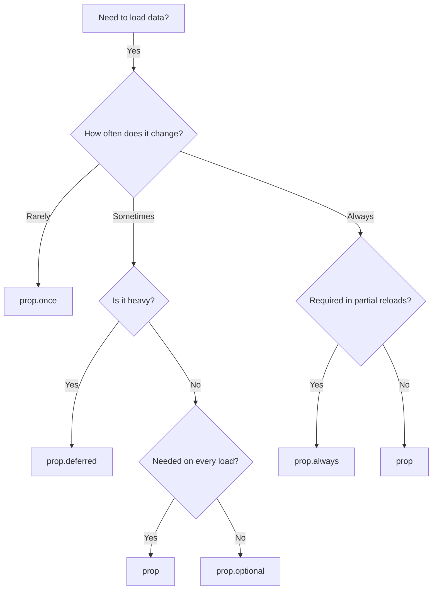

# Props

Props in Inertia Server can be customized with modifiers to control how and when they're loaded.

## Prop Types

| Type | Description |
|------|-------------|
| `prop()` | Standard prop, always included |
| `prop().deferred()` | Loaded after initial render |
| `prop().once()` | Cached on client, not resent |
| `prop().optional()` | Only sent when explicitly requested |
| `prop().always()` | Always included in partial reloads |
| `mergedProp()` | Merged with existing data (infinite scroll) |
| `deepMergedProp()` | Deep merged for nested structures |

## Basic Usage

```typescript
import { createInertia, prop, mergedProp, deepMergedProp } from 'inertia-server';

const { definePage } = createInertia({ version: '1.0.0', render: renderToHtml });

const dashboardPage = definePage({
  component: 'Dashboard',
  props: {
    // Always included
    title: prop<string>(),
    
    // Loaded after initial render
    stats: prop<Stats>().deferred(),
    
    // Cached on client
    config: prop<Config>().once(),
    
    // Only when requested
    heavyData: prop<HeavyData>().optional(),
    
    // Always included in partial reloads
    user: prop<User>().always(),
    
    // Merged with existing data
    items: mergedProp<Item[]>(),
  },
});
```

## Choosing the Right Prop Type



## Next Steps

- [Basic Props](/props/basic)
- [Deferred Props](/props/deferred)
- [Once Props](/props/once)
- [Optional Props](/props/optional)
- [Merged Props](/props/merge)
